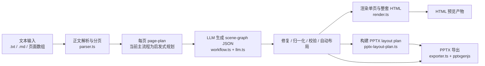

# 文本到 HTML 再到 PPTX 的流程与执行逻辑

## 1. 总体链路

本项目的核心目标是把用户输入的正文型 PPT 文本转换为可预览的 HTML，并进一步导出为可编辑的 PPTX。中间并不是直接从 HTML 截图生成 PPT，而是先生成统一的 `scene-graph JSON`，HTML 和 PPTX 都以这份结构化页面描述为源数据。



执行上有两种入口：

- CLI 一步式：`npm run build-deck -- <input>`，生成页面 JSON、HTML、整套 HTML 和最终 PPTX。
- Web 工作台两段式：先调用 `/api/deck/generate-html` 生成 HTML，再调用 `/api/deck/export-pptx` 基于同一次运行目录导出 PPTX。

## 2. 文本解析与分页

文本入口主要在 `parser.ts` 和 `workflow.ts`：

- `build-deck` 支持 `.txt`、`.md` 和 `.json` 输入。
- `.txt` / `.md` 会进入 `parseDoPptCommandMessage`，识别可选的 PPT 指令前缀，清理代码块包裹、尖括号包裹、空行和元注释。
- 页面用 `---` 分隔，支持 1 到 20 页。
- 每页第一行被识别为标题，后续行作为正文；最终通过 `buildLlmPageContents` 输出字符串数组。
- `.json` 输入可以是字符串数组，也可以是 `{ "pages": [...] }` 结构。

解析后的页面会被保存为运行产物：

- CLI：`output/<输入文件名>/pages.json`
- Web：`output/runs/<run-id>/pages.json`
- 如果输入来自原始指令文本，还会写出 `pages.debug.json`，保存解析前后的调试信息。

## 3. 页面规划与 LLM 生成

`workflow.ts` 是主流程调度中心。每一页会按顺序处理，避免并发请求压垮模型服务，也方便断点续跑。

当前主流程中，每页的 `page-plan` 默认来自 `buildHeuristicPagePlan(pageContent)`，也就是根据文本结构生成启发式页面规划。代码中保留了 `generatePagePlan`，可通过 LLM 生成 page-plan，但 `buildDeckFromInput` 和 `buildDeckHtmlFromPages` 当前实际走的是启发式 plan。

每页 scene-graph 生成由 `generateValidatedSceneGraph` 负责：

- 组装 page text、agent prompt、页码、上一次失败信息等上下文。
- 通过 `requestSceneGraphJsonText` 调用 OpenAI-compatible Chat Completions 接口。
- 原始模型响应写入 `raw/page-xxx.attempt-n.raw.txt`。
- 提取后的 JSON 写入 `raw/page-xxx.attempt-n.json.txt`。
- 支持失败重试、空响应额外重试、瞬时错误延迟重试、质量优化额外重试。
- 如果模型返回 JSON 格式不稳，会进入 JSON repair、normalize、validate 流程。

LLM 配置来自 `llm.ts`：

- CLI 读取环境变量，例如 `LLM_API_BASE_URL`、`LLM_API_KEY`、`LLM_MODEL`。
- Web 读取 `local.config.json`，并通过 `/api/config`、`/api/config/test` 配置和测试。
- `LLM_MOCK_RESPONSE_PATH` 可用于无网络的 mock 模式。

## 4. Scene Graph 的校验、归一化与布局

模型输出不是直接渲染，而是先经过一组防护层：

- `json-repair.ts`：修复常见 JSON 语法问题，例如尾逗号、缺失闭合等。
- `normalize.ts`：把不稳定字段归一化到项目支持的结构，例如颜色、元素类型、文本字段、尺寸字段。
- `validate.ts`：校验 scene graph schema，要求固定画布 `1600x900`、元素坐标不越界、宽高大于 0、类型在白名单内。
- `layout.ts`：执行自动布局，处理 section、cardGroup 等容器内布局和部分重叠问题。
- `layout-refinement.ts`：进一步修正页眉侵入、内容密度、卡片行压缩等布局问题。
- `export-safety.ts`：检查 HTML / PPTX 导出安全性和一致性，避免导出阶段无法复现或出现危险 SVG。

项目支持的核心元素类型定义在 `types.ts`，包括 `title`、`text`、`bulletList`、`callout`、`metric`、`chart`、`timeline`、`process`、`shape`、`svg`、`icon`、`grid`、`connector` 等。PPTX 导出能力围绕这些元素类型逐一实现。

## 5. HTML 渲染逻辑

HTML 生成由 `render.ts` 负责：

- `renderSceneGraphToHtml(graph)` 渲染单页。
- `renderSceneGraphsToHtml(graphs, title)` 渲染整套 deck。
- 所有元素按绝对定位放到固定尺寸的 `.slide-stage` 中，页面尺寸对应 `1600x900`。
- 文本类元素带有 `data-fit-text="true"`，页面加载后执行 `fittingScript`，逐步缩小字体和行高，减少溢出。
- 每份 HTML 都嵌入一段 `<script type="application/json" data-scene-graph>`，保存当前页面的 scene graph。

这个嵌入 JSON 很关键：单页 HTML 可以独立预览，同时也能被 `export-pptx` 重新读取出结构化数据。也就是说，HTML 不是 PPTX 的视觉截图来源，而是携带 scene graph 的预览容器。

主要产物：

- 单页 HTML：`html/page-001.html`、`html/page-002.html`
- 整套 HTML：`<deckName>.html`
- 运行清单：`manifest.json`

## 6. PPTX 导出逻辑

PPTX 导出由 `exporter.ts` 负责，底层使用 `pptxgenjs`。

导出数据来源有两类：

- 从 JSON 导出：直接读取 scene graph。
- 从 HTML 导出：先查找 HTML 内嵌的 `data-scene-graph` JSON；如果没有，再尝试寻找同名 JSON 文件作为 fallback。

完整 workflow 中，PPTX 通常不是从最终 HTML 文件解析多页，而是读取 `manifest.json` 中每一页的：

- `jsonPath`：页面 scene graph。
- `pptxPlanPath`：PPTX 布局辅助计划。

`exportSceneGraphsToPptxFile` 会创建一个 PPTX，按页调用 `addSceneGraphToPptx`：

- 固定 PPT 布局比例，按 `900px` 高度映射到 PowerPoint 英寸单位。
- 每页设置背景和主题 chrome。
- 元素按 `zIndex` 排序后逐个渲染。
- `title`、`text`、`bulletList` 等用 PowerPoint 文本框导出，保持可编辑。
- `shape`、`divider`、`connector` 等用 PPT 原生 shape / line 导出。
- `svg`、`icon` 等视觉元素以 SVG 图片嵌入。
- `chart`、`timeline`、`process`、`matrix`、`funnel` 等复杂元素有各自的导出函数，尽量转成可编辑的 PPTX 结构。

因此，项目的 PPTX 导出策略是“结构化重建”，不是“HTML 截图贴图”。这也是为什么 scene graph schema、布局 plan 和导出安全检查很重要。

## 7. CLI 执行路径

`index.ts` 提供多个命令：

- `npm run parse-do-ppt -- input.txt`：只做文本解析，输出页面数组和 debug JSON。
- `npm run render -- input.json`：把单页 scene graph JSON 渲染为 HTML。
- `npm run preview-json -- output/demo/json`：把已有页面 JSON 快速预览成 HTML。
- `npm run export-pptx -- output/page.html`：从 HTML 或 JSON 导出单页 PPTX。
- `npm run build-deck -- input.txt`：完整执行文本到 HTML 和 PPTX。

`build-deck` 的关键步骤：

1. 解析输入，生成 `pages.json`。
2. 为每页创建 heuristic page-plan，写入 `plan/page-xxx.plan.json`。
3. 调 LLM 生成 scene graph，写入 `raw/` 调试文件。
4. 修复、归一化、校验、布局优化。
5. 写出 `json/page-xxx.json`、`html/page-xxx.html`、`plan/page-xxx.pptx-plan.json`。
6. 所有页完成后，写出整套 HTML 和 PPTX。
7. 更新 `manifest.json`，记录输入、prompt、模型、页数、每页路径、失败信息和最终产物路径。

如果中途失败，已经完成的页面会尝试导出 `.partial.html` 和 `.partial.pptx`；再次执行时会根据 `manifest.json`、输入 hash 和 prompt hash 复用已完成页面。

## 8. Web 工作台执行路径

Web 侧由 `server/index.ts` 提供 API，前端在 `web/src/main.tsx` 调用。

主要流程：

1. `/api/config` 读取模型配置、prompt 选项和历史运行。
2. `/api/config/test` 用短请求测试模型连通性。
3. `/api/outline/chat` 或 `/api/outline/chat/stream` 根据背景信息生成 PPT 正文。
4. `/api/pages/parse` 把正文切成页面卡片。
5. `/api/deck/generate-html` 启动异步 HTML 生成任务。
6. `/api/jobs/:id/events` 用 SSE 推送进度：开始、单页开始、单页完成、HTML 完成、失败。
7. `/api/deck/export-pptx` 在 HTML 完成后读取同一输出目录的 manifest，导出 PPTX。
8. `/api/files?path=...` 只允许下载或预览 `output/` 下的 `.html` 和 `.pptx`。

服务端用 `activeLlmTask` 限制同一时间只跑一个 LLM 任务，避免多个长任务互相抢资源。生成任务有 `AbortController`，前端可调用 stop 接口中止。

## 9. 产物目录与调试价值

一次完整运行会形成如下结构：

```text
output/<deck-name>/
  pages.json
  pages.debug.json
  manifest.json
  raw/
    page-001.attempt-1.raw.txt
    page-001.attempt-1.json.txt
  plan/
    page-001.plan.json
    page-001.pptx-plan.json
  json/
    page-001.json
  html/
    page-001.html
  <deck-name>.html
  <deck-name>.pptx
```

这些文件分别服务于不同调试场景：

- `pages.json`：确认文本切页是否正确。
- `raw/*.raw.txt`：确认模型完整响应。
- `raw/*.json.txt`：确认 JSON 提取是否正确。
- `json/*.json`：确认最终可渲染 scene graph。
- `html/*.html`：定位单页视觉问题。
- `plan/*.pptx-plan.json`：定位 HTML 到 PPTX 的布局复现问题。
- `manifest.json`：恢复运行、导出 PPTX、查找最终文件路径的中心索引。

## 10. 执行逻辑要点

- 中间表示是 scene graph：文本不会直接变 HTML，也不会直接变 PPTX。
- HTML 与 PPTX 是同源双出口：它们都依赖同一份 scene graph，PPTX 还会参考 pptx layout plan。
- 主流程按页串行：便于重试、限流、保存中间产物和断点续跑。
- LLM 输出必须过校验：JSON repair、normalize、validate、auto-layout、layout refinement、安全检查都在渲染前发生。
- HTML 内嵌 scene graph：让 HTML 可预览，也能作为单页导出 PPTX 的结构来源。
- PPTX 是可编辑重建：大多数元素映射到 PowerPoint 原生文本框、形状、线条和图片，而不是截图。
- Web 侧把 HTML 和 PPTX 拆开：生成 HTML 是长任务，导出 PPTX 是基于 manifest 的后续动作。
- 运行目录是状态中心：所有恢复、下载、历史记录、导出都围绕 `manifest.json` 和 `output/` 文件组织。

